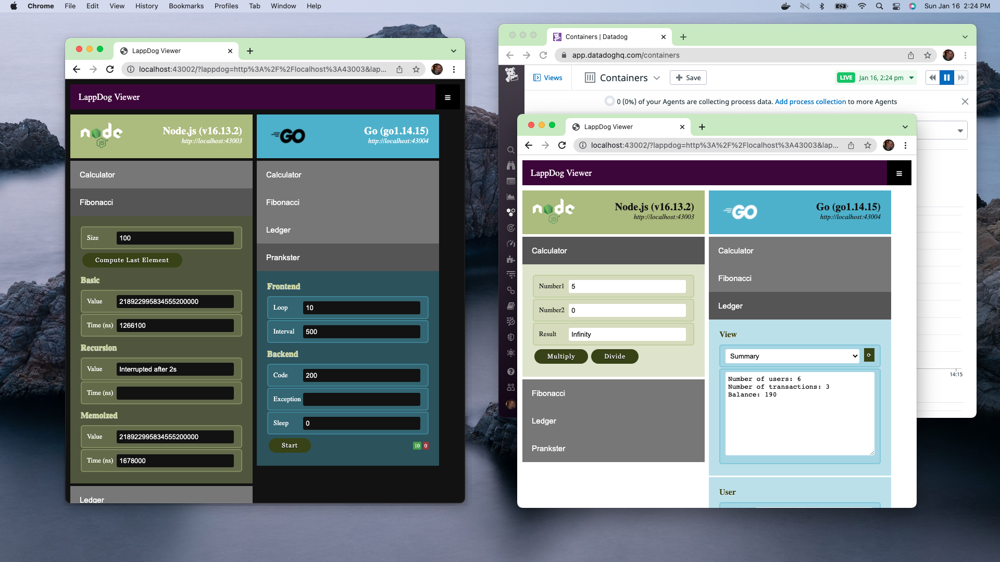

# LappDog

## TL;DR

```bash
# TODO: copy the template files to create the env files.
#   The content of the new files may need to be adjusted.
#   The new files are ignored by git.
cp .env/db.common.env.template .env/db.common.env
cp .env/db.env.template .env/db.env

# Starts the production containers using either
# docker-compose or podman-compose.
#   The compose.sh script is a thin wrapper to handle environment
#     variables and the choice of docker or podman. It does not
#     process any argument.
#   Compose arguments used:
#     -d      starts the containers on the background.
#     --build rebuilds the images.
./compose.sh up -d --build

# TODO: open the viewer on http://localhost:43002
#   Adopt the Node LappDog running on http://localhost:43003
#   Adopt the Go LappDog running on http://localhost:43004

# Stops the containers.
#   -v (optional) clears any storage, including the database one.
./compose.sh down -v
```

## Introduction

The main goal of this project is to learn by experimenting with different technologies - focusing on identifying and adopting the best practices applicable to each.

We quickly noticed that, to accomplish this (ambitious) goal, the project can be neither too simple nor too complex. Alas, achieving this fine balance is not easy. Moreover, deeming something as "simple" or "complex" is certainly a matter of personal experience and preference. Hopefully we will get it right more often than not.

After a great deal of reflection, we chose a design based on "LappDogs":

* A "LappDog" is an small application that exposes a well-defined REST API, defined using [OpenAPI 3.0.3](https://spec.openapis.org/oas/v3.0.3).
* The [LappDog API](./openapi.yaml) is composed by a number of isolated "sections".
* A "section" provides a specific functionality.
  * Examples of sections include a ledger application with persisted data, and a calculator.
  * Each section involves one or more endpoints of the REST API.
* There should be a "viewer" to allow using the sections of any LappDog.
* The only formal requirement for a LappDog is to expose the prescribed REST API.
  * All other decisions are left to the individual implementation, including persistence, transaction, concurrency, and used frameworks.

The very first two LappDogs are implemented using [Node.js](https://nodejs.org) and [Go](https://go.dev/). Coincidentally, the viewer also happens to be implemented using these technologies. Here's a screenshot:


## Rules of Engagement

Sample code and 101 examples are great: this project would not exist without them! That said, we really intend to push the envelop a bit further.

As such, we decided to abide to the following rules:

* Code must not just work: it should be efficient and elegant ;-)
  * The term "code" encompasses any kind of manually generated artifact, including property files, YAML documents, and actual source code.
* Setting up a local development environment must be optional.
  * The project should supply the tools required to produce good code.
* Both the development and production environments must be realized via containers.
  * Supporting both [docker](https://www.docker.com/) and (rootless) [podman](https://podman.io/).
* For each technology, we should aim to address real problems:
  * As an example, we invested some time designing how the node containers deal with the `node_modules` directory, to allow for both "local" and "containerized" development.
* All configuration must be done via environment variables defined on "env" files.

## Disclaimers

All artifacts in this project have been developed with the help of resources available on the internet. To the best of our capabilities, we avoid using any copyrighted or proprietary source.

Even though we put a great deal of effort on crafting good code and using good patterns, we may have done something that is "less optimal" or even "blatantly wrong". Hopefully we will have the opportunity to learn by addressing those.

*In summary*, we are not responsible for anything that may happen if you decide to use the ideas, design, and code we created. Be warned!

On the other hand, we will not go after you for using anything you like here - we appreciate shoutouts and feedback though ;-)

## Requirements

The project is developed mostly on Macs, using both Big Sur and Monterey. Less often than desired, we also use machines running [Arch Linux](https://archlinux.org/).

* [Docker](https://www.docker.com/) or [Podman](https://podman.io/).
* [Docker Compose](https://docs.docker.com/compose/) or [Podman Compose](https://github.com/containers/podman-compose)
  * Docker Compose is usually installed with Docker.
  * Podman Compose can be installed from the source code or via package managers, like `sudo pacman -S podman-compose` on Arch Linux.
* Bash to run the scripts.
  * Some of our shell scripts do look outdated. Unfortunately we cannot use newer constructs because Macs [are stuck with a fairly old version of Bash](https://www.quora.com/Why-does-Mac-OS-X-have-outdated-versions-of-Shell-and-Coreutils) - and, for now, we chose not to require the [Z shell](https://en.wikipedia.org/wiki/Z_shell).

## The _dd_ Branch

Another goal we have for this project is to understand how such a heterogeneous code can benefit from the awesome monitoring capabilities offered by the [Datadog](https://www.datadoghq.com/) platform. If this is not of interest, just don't ever look at the [dd](https://github.com/m-paternostro/lappdog/tree/dd) branch.

Conversely, if it does spark your curiosity, that branch has all the changes (and only the changes) we made to send profiling, tracing, session, and other information to the Datadog platform.

## Contents

This project hosts several "modules":

| Module | Description |
| --- | --- |
| [viewer](./viewer) | The UI to interact with different LappDogs. The viewer is is basically a collection of static files (HTML, Javascript, and CSS) served by on a very tiny Go application. |
| [node](./node) | Node LappDog |
| [go](./go) | Go LappDog |
| [db](./db) | The [MySQL](https://www.mysql.com/) configuration for the database that is used by the "Ledger" section of the Node and Go LappDogs. |
| [tests](./tests) | Provides "sanity tests" to help determine if the modules are working. |
| [.env](./.env) | The files defining *all* environment variables used by this project. |

## Environment Variables

All configurable information used by this project is specified via environment variables defined by the `env files` located in the [.env](./.env) directory.

Pretty much all environment variables are expected to be passed to the appropriate module when it's executed; regardless if for production or development.  An exception to this rule is the [local.env](./local.env) file, which should only be used by the "code" launching the module, like the [compose.sh](./compose.sh) script.

### Template Files

Template files like [db.env.template](./.env/db.env.template) contain variables that need to be configured before executing any module. These files should be copied to the `.env` directory (stripping the `.template` extension) and properly adjusted. The copies are ignored by git.

### Env Files

| File | Description |
| --- | --- |
| [common.env](./.env/common.env) | Common environment variables for all modules. |
| [db.common.env](./.env/db.common.env.template) | Environment variables for modules that need to access the database. |
| [db.env](./.env/db.env.template) | Environment variables for the [db](../db) module. |
| [dev.env](./.env/dev.env) | Environment variables for the development environment. |
| [container.env](./.env/container.env) | Environment variables for the container environment. |
| [local.env](./.env/local.env) | Environment variables that are not meant to be passed to modules (they only apply to the host). |

## Tests

The following snippet shows how to run all tests:

```bash
# Starts the production containers using composer.
./compose.sh up -d --build

# Runs all tests.
#   The user must inspect the generated output looking for errors.
./test/suite.sh

# Stops the containers.
./compose.sh down -v
```

See the test [documentation](./tests/README.md) for more details.

## Development Environment

If setting the development environment locally (i.e., on the host) is not feasible, all modules of this project can be developed using development-specific containers. The containers and images store all dependencies and other intermediate artifacts, which leave the host with only the important, user-generated files.

The following snippet shows how to start the development container for the [node](./node) module and then run the server and test.

```bash
# Starts the production containers using composer.
./compose.sh up -d --build

# Starts the node container development environment.
./compose.sh up -d --build devnode

# Runs the development server.
#   The top of the output highlights the host port for the server.
#      This port is defined by the LAPPDOG_DEV_NODE_PORT environment
#        variable.
#   The server automatically refreshes on code changes.
#   This command blocks the shell:
#      This allows for viewing debugging messages.
#      Use a different shell to run another command.
#      Exit the command by pressing CTRL+C .
./execlabel.sh lappdog_dev_node dev.run

# Runs a node-specific test.
./test/implementations/curl/node.sh $LAPPDOG_DEV_NODE_PORT

# Stops all containers.
./compose.sh down -v
```

### Commands

Working with code requires performing a few "tasks" including running the code, linting the code, gathering dependencies, and building artifacts. Inspired by [Podman's runlabel](https://podman.io/blogs/2018/12/03/podman-runlabel.html), to improve the developer experience, the development containers automate these tasks via commands, available as image labels like `dev.run` and `dev.lint`.

To run such a command, use the [execlabel.sh](./execlabel.sh) script as follows:

```bash
# Lists the names of all active containers.
./execlabel.sh

# Lists all labels of the image of a container.
#   Some labels are not 'commands'.
./execlabel.sh lappdog_dev_go

# Executes the value of a label.
./execlabel.sh lappdog_dev_go dev.lint
```

The value of a label is executed using the container runtime `exec` command as follows:

```bash
# If docker is not installed, the value of the label value is
#   passed to podman.
docker exec -ti <container> <value of the label>
```

These are the development containers and respective commands:

```bash
# Node LappDog

# Starts the development container.
./compose.sh up -d --build devnode

# Lists all labels.
./execlabel.sh lappdog_dev_node

# Analogous to 'npm install'.
#   Can modify the package*.json files.
#   Accepts arguments like new modules.
./execlabel.sh lappdog_dev_node dev.install
./execlabel.sh lappdog_dev_node dev.install dd-trace

# Lints the code (without modifying it).
./execlabel.sh lappdog_dev_node dev.lint

# Runs the development server.
#   The top of the output highlights the host port for the server.
#   The server automatically refreshes on code changes.
#   This commands blocks the shell:
#      This allows for viewing debugging messages.
#      Use a different shell to run another command.
#      Exit the command by pressing CTRL+C .
./execlabel.sh lappdog_dev_node dev.run

# Analogous to 'npm update'.
#   Can modify the package*.json files.
#   Should be executed every time there is a change to package.json.
./execlabel.sh lappdog_dev_node dev.update
```

```bash
# Go LappDog

# Starts the development container.
./compose.sh up -d --build devgo

# Lists all labels.
./execlabel.sh lappdog_dev_go

# Builds code generating an executable.
#   The executable target OS can be specified as an argument.
#   The executable location is 'go/bin/server'.
./execlabel.sh lappdog_dev_go dev.build
./execlabel.sh lappdog_dev_go dev.build darwin

# Lints the code.
./execlabel.sh lappdog_dev_go dev.lint

# Runs the development server.
#   The top of the output highlights the host port for the server.
#   The server automatically refreshes on code changes.
#   This commands blocks the shell:
#      This allows for viewing debugging messages.
#      Use a different shell to run another command.
#      Exit the command by pressing CTRL+C .
./execlabel.sh lappdog_dev_go dev.run

# Analogous to 'go mod tidy'.
#   Can modify the go.* files.
#   Should be executed every time there is a change on dependencies.
./execlabel.sh lappdog_dev_go dev.tidy
```

The [viewer](./viewer) module has both Node and Go code:

* The Node code is used during development time to create the set of static files that run on the browser.
* The go code implements a small application that serves these files and exposes environment variables.

Each one of these parts has its own development container, each offering the same commands listed above for the node and go containers.

```bash
# LappDog Viewer (Node code)

# Starts the node development container.
./compose.sh up -d --build devviewer

# Lists all labels.
./execlabel.sh lappdog_dev_viewer

# Builds the static files.
#   The files location is 'viewer/dist'.
./execlabel.sh lappdog_dev_viewer dev.build

# Same commands as the node container.
#   As before, the dev.run command picks up any change automatically,
#     however the browser may need to be refreshed to reflect it.
./execlabel.sh lappdog_dev_viewer dev.install
./execlabel.sh lappdog_dev_viewer dev.lint
./execlabel.sh lappdog_dev_viewer dev.run
./execlabel.sh lappdog_dev_viewer dev.update
```

```bash
# LappDog Viewer (Go code)

# Starts the go development container.
./compose.sh up -d --build devviewergo

# Lists all labels.
./execlabel.sh lappdog_dev_viewer_go

# Same commands as the go container.
./execlabel.sh lappdog_dev_viewer_go dev.build
./execlabel.sh lappdog_dev_viewer_go dev.lint
./execlabel.sh lappdog_dev_viewer_go dev.run
./execlabel.sh lappdog_dev_viewer_go dev.tidy
```

The following snippet shows how to start all development containers:

```bash
# Starts all development containers.
./compose up -d --build devviewer devviewergo devnode devgo
```

## License

Everything we produced here is licensed under the [MIT License](./LICENSE).
